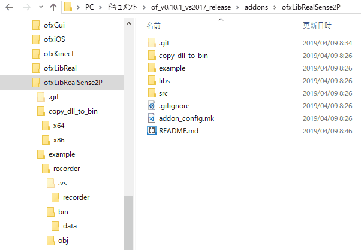

# ofxLibRealSense2P
libRealSense2 addon for openFrameworks.

#### - feature
- getWorldCoordinate from pixel coordinate.
- record frames to bag file.
- play back function.
- pixel align feature.

#### - supported OS
- Windows 10

#### - supported Device
- D415 / D435

#### - recommendate firmware version
- \> 5.11.1.100
 ( found [here](https://downloadcenter.intel.com/product/128255/Intel-RealSense-Depth-Camera-D435) )

#### - how to use
 - copy dll file to bin directory.

 

 - set build target x64
 
#### - special thanks to
 [@shiyamon](https://github.com/shiyamon/ofxLibRealSense2)
 
